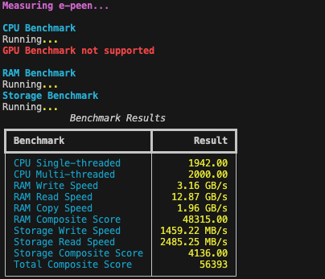

# E-Peen

E-Peen is a benchmarking tool for your e-peen. It's a tool that measures your pc's performance and calculates a score based on the results. The higher the score, the bigger your e-peen is. It's a fun way to see how your pc stacks up against others.

## Current Features
- CPU Benchmark
- GPU Benchmark
- RAM Benchmark
- Storage Benchmark

## Installation

To install E-Peen for development, simply run the following commands:

```bash
git clone https://github.com/crosschainer/e-peen
cd e-peen
pip install -e .
```

To install E-Peen for use, simply run the following command:

```bash
pip install e-peen
```

## Usage

To use E-Peen, simply run the following command:

```bash
e-peen
```



## Contributing
Pull requests are welcome. For major changes, please open an issue first to discuss what you would like to change.
